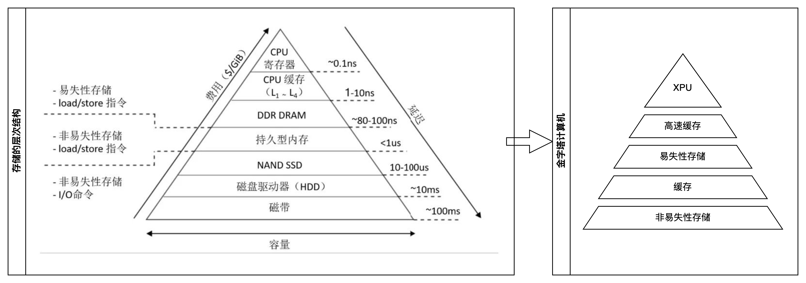
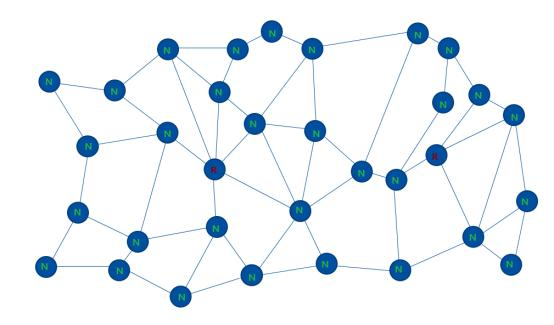

# 软件定义计算机的理论模型与核心法则

本文档整合了基于分布式账本的计算机体系架构的**理论模型**和**核心法则**，是理解整个架构设计的核心参考资料。

:::info 版权信息
**作者**: 杭州超导账本科技有限公司，创始人：黄立峰 (cdzb168@163.com)  
本作品采用 [署名—非商业性使用—相同方式共享 4.0 协议国际版（CC BY-NC-SA 4.0）](https://creativecommons.org/licenses/by-nc-sa/4.0/) 进行许可。
:::

---

# 第一部分：理论模型

## 两个理论模型

### 金字塔计算机模型

**模型说明：**

> 注意: 左图中 DRAM 之下的几个存储层两两之间都有缓存，通常是由 SRAM 组成的，这是所有存储设备厂商的通用做法，这种做法使得在一定范围内，顺序读写一定是最快的！！

在金字塔模型中的连续的两个不同存储层之间都有缓存的存在（如图中灰色斜线层所示），这种结构决定了其实现效率最大化的必然只能是顺序读写，追加写的 FIFO 队列，或者说是类磁带的读写策略，多层就是多个磁带，上层的磁带读写速度都比下层快；

**数据的操作策略：**

- 数据是不可变的，删除时只打标记，用遗忘代替就地更新；
- 在数据从 n 层转移到 n+1 层的时候，可以对数据进行真正删除，也就是遗忘处理；
- 与时间不可逆法则结合，可以得出更加高效的计算机系统
- 单个计算机节点可以简化为多层级的先进先出队列，相邻层级之间有缓存；
- 整个金字塔存储结构，最理想的情况就是缓存足够大使得其不被击穿的情况下，整个金字塔的读写效率只与缓存的**串行顺序**读写性能有关，与各层物理介质的读写性能无关；

### 对等网络

1. 计算机的各级系统都可以视作是一个网络，这是一种具有普适性的基础原理；
2. 芯片内部的核心可以组成一个网络，甚至有专门的 NoC，也就是片上网络；
3. 操作系统内部的多个进程可以组成一个网络；
4. 多个计算机节点可以组成一个网络；
5. 数据中心、互联网更是一个复杂网络；

 

## 核心思想

1. 原子论 vs 网络论，一切皆网络，万物相互关联；
2. 网络是相互关联的，仅仅只研究个体行为是不够的，不能将个体与整体相切割；
3. 复杂网络上是能够产生出远超个体智慧程度的复杂智能；
4. 财富具有零和性（零和博弈的零和），尤其是在货币上表现的更加明显，本质上每一次法币的交换都必须被监管，同时又要注重隐私保护；监管和隐私保护要兼顾；过于匿名的加密币是不适合绝大部分普通人的；
5. 物质、能量、信息是组成这个世界的基础元素；
6. 复杂系统中最核心的应该是平衡，中庸，最能代表这种思想的就是太极图；阴阳对立而又统一。

---

# 第二部分：基础法则

## 基础法则

### 一、实事求是

定义：一切以事实为基础；

本规则即是基础规则，也是核心指导精神，其思想贯穿始终；

### 二、时间是不可逆的

#### 定义

时间是不可逆的。

- 时光有如一支永不回头的箭，是不可逆的。
- 昨天已逝，没有人可以回到过去，所以昨天的事物、已经发生的事件是永远无法改变的； 
- 明天尚未发生，一切未知； 
- 唯一可以改变的只有今天；
- 所以说，今天的世界在不断变化，昨天的世界或者历史是不可改变的；变化是永恒的，不变也是普遍的。

该法则可以推导出函数编程范式中的绝大部分核心技巧，以及很多只有少数 IT 专家才知道的技巧（如 CoW：写时复制, C）

#### 推论
1. 在时间轴上按照先后顺序，可以将时间划分为：过去（昨天），现在（今天），未来（明天）；
  - 过去已经发生，没有人能够回到过去改变历史，所以过去是不可变的；
  - 未来尚未发生，未来只取决于当下，与过去无关；
  - 当下的状态只与昨天有关，只有现在才是人们可以掌控，可以把握的，可以改变的，要改变明天，只能从当下开始；
2. 结合金字塔计算机模型，该法则决定了，单台计算机可以简化为多层级的先进先出的队列，每个队列之间有缓存；
在最理想的情况下，也就是缓存没有被击穿的理想情况下，整个金字塔的读写速度只取决于缓存的读写速度，与每层的物理介质没有关系，串行顺序读写是最高效的利用方式；
3. 只有基于分布式账本技术实现的系统才能真正完备的做到这一点；

### 三、以人为本

计算机系统是人类打造的信息系统，自然应该围绕人类、以人为中心构建；

推论：
- 需要有统一的账户系统，非中心化的、统一的、薄而广的账户系统；相当于在不同的地块之间构建四通八达的交通设施；
- 这是"普天之下莫非王土，率土之滨莫非王臣"思想的体现，这是你的土地、房子、车子等大件资产能够自由流通的理论基础；
- 或者用现在流行的术语是"对齐"，账户系统的对齐；
- 合理适当的对齐可以带来涌现；
- 需要有统一的账户系统，以身份为中心，同时减少数据孤岛带来的效率损耗，与不应该产生的额外有害信息差；
- 割裂人与设备、资产、应用等的关联，会导致（在并行化的前置过程：矩阵化过程中）多重维度的丧失，从而导致很多并行化的机会无法被利用；

好处：
- 账户系统的对齐带来了更多并行化的可能性，是实现无锁化、实现更高并行度的必要条件；
- 现在的计算机系统没有实现账户系统的对齐，导致数据库系统、云计算、AI 损失了很多并行化、无锁化的机会，必然无法与新一代的计算机体系结构相媲美；

### 四、所有权法则

定义：同一时间系统中的任何资源只能有唯一的所有者，支持所有权与使用权分离；（这是与生活常识保持一致的）

系统中任何资源都只能被其唯一的所有者所支配；
所有者可以是个体或组织机构；

### 五、因果法则

定义：先因后果，因果分离

这一点主要针对指令集、数据集，只有遵循该法则，才能在保留因果关系的同时，提升系统并行效率；

### 六、矛盾法则

定义：任何实体同一时间最多只能做一件事情；

推论：
- 任何实体同一时间只可能处于唯一的一种状态；
- 任何实体的某个属性同一时间只可能具有唯一确定性的值；
- 结合其他法则，此法则可以大幅简化分布式系统中的一致性问题；

### 七、零信任法则

- 从不信任，保持验证；
- 安全防护从以网络位置为中心，转变为以身份为中心；

这是拜占庭环境下保证系统安全所必须遵守的法则

### 八、原子化与持久化

- 原子化：确保事务中的操作要么全部执行，要么全部不执行，从而提供一种全有或全无的语义。
- 持久化：确保在事务中写入的任何数据都是永久性的。

ACID 法则中的 CI 两项已经不再需要，因为以上其他法则已经实现了一致性和隔离性，而且标准更加高；

### 九、实践是检验真理的唯一标准

实践是检验真理的唯一标准。以上都是很抽象的基础法则，看似简单到就是生活常识，实则应用起来奇妙无比，可以起到化繁为简的作用，可以用更少的成本、资源、代码做到更多的事情，而且还能更加高效、安全、可靠；

---

## 版权

本作品采用 署名—非商业性使用—相同方式共享 4.0 协议国际版（CC BY-NC-SA 4.0）进行许可。
